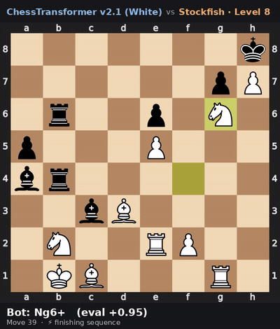

# ChessTransformer

> A transformer chess engine trained **only on human games** — no self-play, no reinforcement learning — reaching **~2100 Elo** against Stockfish on a single consumer GPU.

The model predicts moves directly from board positions, then plays via an AlphaZero-style MCTS (policy priors + value head). A compiled alpha-beta engine is available as an alternative.

**▶ [Play it in your browser](https://huggingface.co/spaces/tchauffi/ChessTransformer)** — live demo on Hugging Face Spaces (no install).

## Demo

ChessTransformer v2.1 (White, MCTS @ 800 sims) checkmating Stockfish Level 8 — the finishing sequence:



▶ [Watch the full game (MP4)](docs/demo.mp4) · 🤗 [Play live on Hugging Face Spaces](https://huggingface.co/spaces/tchauffi/ChessTransformer)

## Highlights

- **11.7M-parameter transformer** (`Pos2MoveV2`), trained from scratch purely by predicting human moves.
- **~2100 Elo** vs Stockfish — MLE estimate over a 140-game gauntlet (skills 0–12).
- **AlphaZero-style MCTS / PUCT** search using the policy head for priors and the value head for leaf scores.
- **2.3× faster inference** via `torch.compile` + CUDA graphs — lossless (identical moves).
- Runs on one GPU. No self-play, no RL, no cloud.

## How it works

### Model — Pos2MoveV2

| Component | Details |
|---|---|
| Parameters | 11.7M |
| Attention | Grouped Query Attention (8 heads, 4 KV groups) + QK-norm |
| Position bias | Learnable chess-geometry relative bias (8 relation categories: file, rank, diagonal, knight-reach, king-adjacent, nearby, far, global) |
| Policy head | AlphaZero-style 64×73 action planes |
| Value head | Board state → scalar in (−1, 1) |
| Training | Muon + AdamW mixed optimizer, BF16, stochastic depth |

### Search

Two engines share the same network; both run a `torch.compile` / CUDA-graph forward (~2.3× faster, lossless).

- **MCTS / PUCT** (`Pos2MoveV2MctsBot`, **default**) — policy head → priors, value head → leaf scores, most-visited move chosen. Batched-leaf evaluation with virtual loss amortizes the GPU→CPU sync (~8× faster than single-leaf). Tuned for exploitation: first-play-urgency (`fpu=0.2`) and `c_puct=1.0`. **Tree reuse** re-roots the retained subtree under the moves played, giving deeper search at the same per-move cost. Default **800 sims/move**.
- **Alpha-beta** (`Pos2MoveV2Bot`) — iterative-deepening negamax with quiescence search, policy-prior move ordering, and a Zobrist transposition table.

## Results

MCTS @ 800 sims (`c_puct=1.0`, `fpu=0.2`, tree reuse), model v2.1, 20 games/level vs Stockfish (`scripts/tune_vs_stockfish.py`):

| Stockfish skill | Approx. Elo | Score |
|---|---|---|
| 0–6 | ≤ 1500 | 100% |
| 8 | ~1700 | 90% |
| 10 | ~1900 | 85% |
| 12 | ~2100 | 35% |

**MLE estimate: ~2100 Elo.** Elo is fit by maximum likelihood over all games rather than averaging per-level estimates (which is biased low — saturated easy levels cap at a low value and drag the mean down).

<details>
<summary><b>What moved the needle</b> (inference-side, no retraining)</summary>

| Change | Effect |
|---|---|
| **MCTS / PUCT engine** (new default) | beat the alpha-beta engine ~82% head-to-head |
| **`torch.compile` + CUDA graphs** | forward ~2.3× faster (lossless) |
| **Batched-leaf MCTS** (virtual loss) | ~8× faster per sim — amortizes the GPU→CPU sync |
| **Search tuning** — FPU (`fpu=0.2`), `c_puct=1.0`, 800 sims | +~280 Elo over the untuned MCTS@400 baseline (~1793) |
| **Tree reuse** across moves | re-roots the retained subtree — deeper search at the same per-move cost |
| **MLE Elo estimator** | per-level averaging was biased low; fit a single Elo over all games |

*Tried and rejected:* **Stockfish policy distillation** — no gain even at 200k labels (the policy is near the 11.7M model's capacity ceiling).

</details>

## Quick Start

### Docker (recommended)

```bash
docker compose up --build
```

- Frontend: http://localhost:3000
- API: http://localhost:5001

Model weights are baked into the backend image — no volume mounts needed. For GPU, the `deploy.resources.reservations` are already set in `docker-compose.yml`; you just need the [NVIDIA Container Toolkit](https://docs.nvidia.com/datacenter/cloud-native/container-toolkit/latest/install-guide.html) on the host.

### Local development

```bash
uv sync                            # install deps
uv run python backend/api.py       # start backend (port 5001)

cd frontend && npm install && npm run dev   # start frontend (port 3000)
```

Open http://localhost:3000 and start playing.

**Environment variables:**

| Variable | Default | Description |
|---|---|---|
| `MODEL_PATH` | `data/models/pos2move_v2.1` | Path to a checkpoint directory |
| `ENGINE` | `mcts` | Search engine: `mcts` or `alphabeta` |
| `MCTS_SIMS` | `800` | MCTS simulations per move (when `ENGINE=mcts`) |
| `ALLOWED_ORIGINS` | `*` | Comma-separated CORS origins |

## Training

**1. Build the dataset.** `scripts/build_db.py` downloads elite games from [database.nikonoel.fr](https://database.nikonoel.fr) and converts them to HDF5 in one step (bullet/blitz excluded by default).

```bash
uv run scripts/build_db.py                      # last 12 months (default)
uv run scripts/build_db.py --from 2024-01 --to 2024-12   # date range
uv run scripts/build_db.py --last 6             # last 6 months
uv run scripts/build_db.py --all                # everything available
uv run scripts/build_db.py --skip-download      # re-convert existing PGNs
```

Output goes to `data/elite_db.h5`; raw PGNs are cleaned up unless `--keep-raw` is passed.

**2. Train.**

```bash
uv run src/chesstransformer/trainers/pos2move_v2_trainer.py
```

**3. Evaluate.**

```bash
# Tune & benchmark search budget vs Stockfish (alpha-beta depths + MCTS sims)
uv run scripts/tune_vs_stockfish.py data/models/pos2move_v2.1 --games 8 --skills 0 2 4 6 8

# Deterministic engine-vs-engine A/B (MCTS vs alpha-beta, model A vs B, ...)
uv run scripts/engine_match.py --a-mcts --a-sims 400 --b-quiescence 4 --b-depth 3

# Inference speed + lossless-regression guard
uv run scripts/bench_inference.py --depth 3 --save-golden golden.json
uv run scripts/bench_inference.py --depth 3 --check golden.json

# Render a gameplay clip vs Stockfish
uv run scripts/render_game_clip.py --skills 8 10 --sims 800 --out clip.mp4
```

## Project layout

<details>
<summary>Directory tree</summary>

```
ChessTransformer/
├── backend/
│   ├── api.py                        # FastAPI server (move, evaluate, validate endpoints)
│   └── Dockerfile
├── frontend/                         # Next.js web app (human vs bot)
│   └── app/components/ChessGame.tsx  # Main game component
├── data/
│   └── models/
│       ├── pos2move_v2.1/            # Bundled model weights (default)
│       └── pos2move_v2/              # Previous weights (fallback)
├── scripts/
│   ├── build_db.py                   # Download elite games and build HDF5 database
│   ├── tune_vs_stockfish.py          # Sweep alpha-beta depth / MCTS sims vs Stockfish
│   ├── elo_gauntlet.py               # Elo estimation vs Stockfish (alpha-beta)
│   ├── engine_match.py               # Deterministic engine-vs-engine A/B
│   ├── bench_inference.py            # Inference speed + lossless-regression guard
│   ├── render_game_clip.py           # Render a bot-vs-Stockfish game to MP4
│   ├── export_onnx.py                # ONNX export for TensorRT
│   ├── quantize_onnx.py              # INT8 quantization
│   ├── dataset_sanity_check.py       # Dataset distribution analysis
│   └── compress_pgn_to_zst.py        # PGN compression utility
├── src/chesstransformer/
│   ├── bots/
│   │   ├── pos2move_v2_mcts_bot.py   # MCTS / PUCT bot (default)
│   │   ├── pos2move_v2_bot.py        # Alpha-beta bot (with quiescence + compile)
│   │   └── random_bot.py
│   ├── models/
│   │   ├── transformer/pos2move_v2.py  # Model architecture
│   │   └── tokenizer/
│   │       ├── alphazero_move_encoder.py  # 64×73 action planes
│   │       ├── position_tokenizer.py
│   │       └── move_tokenizer.py
│   ├── datasets/
│   │   ├── h5_lichess_dataset.py     # HDF5 dataset with phase-weighted sampling
│   │   └── dataset_h5_convertor.py
│   ├── optimizer.py                  # AdamW + Muon combined optimizer
│   └── trainers/
│       └── pos2move_v2_trainer.py
├── docker-compose.yml
├── pyproject.toml
└── uv.lock
```

</details>

**Development extras:**

```bash
uv sync --group dev         # linting / formatting
uv sync --group optimized   # ONNX / TensorRT export
```
