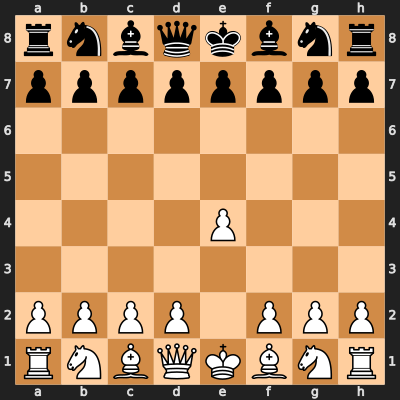
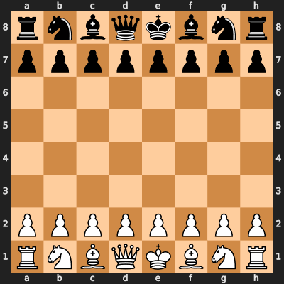

# Tokenization strategy

The tokenization strategy for chess moves is a crucial aspect of this project. The goal is to convert chess moves into a format that can be processed by the transformer model.

## How to represent chess moves?
Let's look a basic starting move: `e4`.



In this position, the pawn on e2 moves to e4. One solution for this position could be to encode the chess board actual position using ascii chess notation.

```
r n b q k b n r
p p p p p p p p
. . . . . . . .
. . . . . . . .
. . . . P . . .
. . . . . . . .
P P P P . P P P
R N B Q K B N R
```

This representation is easy to understand for humans, but not optimal for a transformer model.

An other solution is to use a more compact representation, such as the following:

```rnbqkbnr/pppppppp/8/8/4P3/8/8/PPPP1PPP/RNBQKBNR w KQkq e3 0 1```

This representation is more compact, but still not optimal for a transformer model as it capture the full board position on a T step of the game, which will not capture the sequential nature of chess moves.

A better solution is to use the Algebraic notation for chess moves, which is a standard way of representing chess moves using a combination of letters and numbers. For example, the move `e4` can be represented as `e4`, and the move `Nf3` can be represented as `Nf3`.

This representation is more compact and captures the sequential nature of chess moves, making it more suitable for a transformer model.

Another possibility is to use the UCI (Universal Chess Interface) notation, which is a standard way of representing chess moves using a combination of letters and numbers. For example, the move `e4` can be represented as `e2e4`, and the move `Nf3` can be represented as `g1f3`.

This representation is more compact and captures the sequential nature of chess moves, making it more suitable for a transformer model.

## Other considerations

**Special moves**: The tokenization strategy should also consider special moves such as castling, en passant, and pawn promotion. These moves have specific notations in both Algebraic and UCI notation that should be correctly tokenized. For example, castling kingside is represented as `O-O` in Algebraic notation and `e1g1` in UCI notation.

**Handling ambiguities**: In cases where multiple pieces can move to the same square, the notation includes additional information to disambiguate the move (e.g., `Nbd2` indicates that the knight from the b-file moves to d2). The tokenization strategy should account for these cases to ensure accurate representation of moves.

**Endgame scenarios**: The tokenization strategy should also consider how to represent endgame scenarios, such as check, checkmate, and stalemate. These scenarios have specific notations (e.g., `+` for check, `#` for checkmate) that should be correctly tokenized.

**Party outcome**: The tokenization strategy should also consider how to represent the outcome of the game, such as win, loss, or draw. This information can be useful for training the model to understand the consequences of certain moves. The outcome is typically represented as `1-0` for a white win, `0-1` for a black win, and `1/2-1/2` for a draw. In order, to compelment this ending token, we would need a special tocken to indigate the start of the game, such as `<START>` and `<END>` to indicate the end of the game.

**Move separation**: We are going to use the BPE (Byte Pair Encoding) tokenizer from the `tokenizers` library to tokenize the moves. This tokenizer is capable of handling subword tokenization, which is useful for capturing the structure of chess moves. To separate individual moves in a game sequence, we will use a special `<STEP>` token between each move. This approach provides a clear delimiter that won't be confused with the move notation itself. For example, a sequence of moves could be represented as `e2e4 <STEP> e7e5 <STEP> g1f3 <STEP> b8c6` in UCI notation.

## Our tokenization prototype

If we summarize the above considerations, we can define our tokenization strategy as follows:
- Use UCI notation for representing chess moves (e.g., `e2e4`, `g1f3`).
- Use special tokens for game start `<START>` and game end `<END>`.
- Separate individual moves using a special `<STEP>` token.
- Include special move notations (e.g., `O-O` for castling) and disambiguation (e.g., `Nbd2`).
- Use BPE tokenizer from the `tokenizers` library for subword tokenization.
- Represent game outcomes with standard notations (<1-0>, <0-1>, <1/2-1/2>).

Here is an example of a tokenized sequence of moves in a chess game using our proposed strategy:

`<START> e2e4 <STEP> e7e5 <STEP> f1c4 <STEP> b8c6 <STEP> d1h5 <STEP> g8f6 <STEP> h5f7 <1-0> <END>`

[]

This sequence represents the moves of a chess game starting with `e2e4`, followed by `e7e5`, and so on, ending with a white win (`1-0`). Each move is separated by the `<STEP>`token, and the entire sequence is enclosed between the `<START>` and `<END>` tokens.
